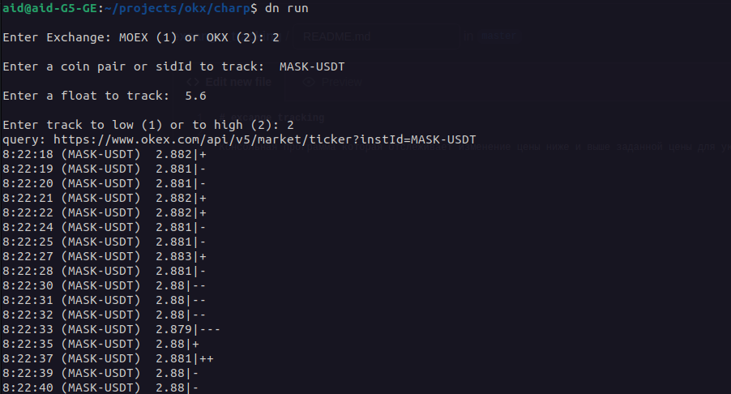

# Excange Tracking Console

Консольная программа которая отслеживает изменение цены ниже и выше заданной цены для указанного финансового инструмента на **MOEX** и **OKX**.

Установка и запуск:
- git clone https://github.com/SerTimBerrners-Lee/excange_tracking
- cd ../excange_tracking && dotnet run 
- Выбираем биржу MOEX или OKX
- Вводим название инструмента который хотим отслеживать
- Вводим число ниже или выше которого будет получено уведомление
- Выбираем когда мы хотим получить уведомление
	1. Когда стоимость инструмента будет ниже указаной нами
	2. Когда стоимость инструмента будет выше указанной нами

Основные особенности:
- После установки инструмента и запуска отслеживания программа будет выполняться до тех пор пока стоимость инструмента не превысит или не будет меньше установленной стоимости в соответствии с выбором пользователя, в процессе отслеживания каждую секунду программа выводит время, текущее значение и анализ текущей цены (выше или ниже) предыдущего значения в виде + если выше и - если ниже.
- Если значение превысит или будет меньше установленной стоимости инструмента, произойдет выход из программы. Высветится окошко уведомление с сообщением поверх других окон, сообщение также будет продублированно на почту и все это будет сопровождаться громким звуковым сигналом.

Examples: 

